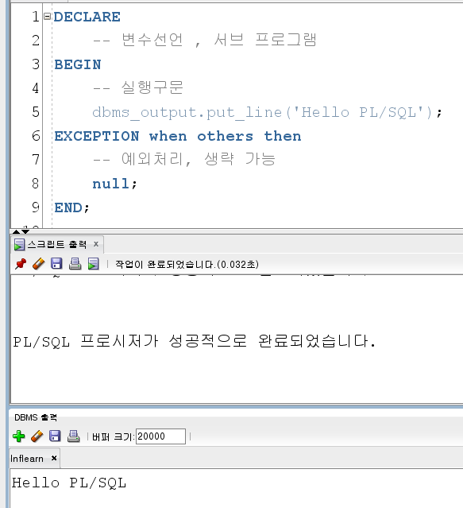
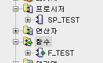

# PL/SQL 기본구조

## PL/SQL block - 익명 블록


```sql
DECLARE
    -- 변수선언, 서브 프로그램
    -- 바깥의 변수는 BEGIN문 안의 BEGIN문이 있다면 그 안에서도 이 선언한 변수를 사용할 수 있다.
    -- 변수가 없다면 DECLARE도 생략 가능하다.
BEGIN
    -- 실행구문   
    dbms_output.put_line('Hello PL/SQL');
    -- BEGIN문 안에는 블록을 추가로 넣을 수 있다. 그러면 블록 안의 블록이 된다.
    -- BEGIN문 안의 BEGIN문에서 에러 핸들링을 했다면, 그 핸들링한 부분에서 에러가 나거든 그대로 다음 내용으로 진행할 수 있다.
EXCEPTION when others then
    -- 예외처리, EXCEPTION문은 생략 가능하다.
    null;
END;
```



## 익명 블록에 이름을 붙여서 사용

DECLARE로 시작하는 익명 블록에 이름을 붙인 것이 FUNCTION, PROCEDURE이다.  
이름을 붙이게 되면 스키마에 저장된다. 즉, 하나의 오브젝트가 된다.

이 내용들은 DB를 다시 구동해도 그대로 있는 것이다. 그렇다는 것은 DB에 저장되어 있다는 것이 된다.
이 내용들을 Stored Procedure, Stored Function이라고 이름 붙인다.



붙일 수 있는 이름들
- function
- procedure
- package
- trigger

익명 블록은 에디터를 닫으면 저장을 하지 않았으니 없어진다.  
마치 어떤 프로그램을 파일을 만드는데, 파일 이름 없이 에디터에 계속 프로그래밍하는 것과 같다고 보면 된다.

만약 PL/SQL 구문을 만들었다면 저장을 해줘야 한다.