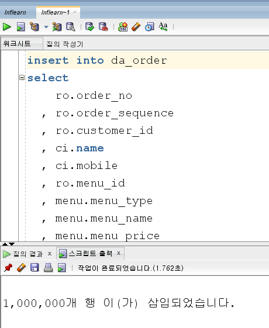
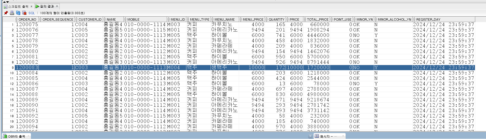

# 데이터 이관 (Migration)

데이터 이관(Migration)에서도 PL/SQL은 강력한 힘을 발휘한다.

시나리오 : 매일 새벽 어제까지의 주문서 데이터를 기준으로 분석 데이터를 생성한다.

먼저 테이블을 생성한다.

```sql
create table DA_ORDER (
    order_no number(10)
  , order_sequence number(5)
  , customer_id varchar2(30)
  , name varchar2(30)
  , mobile varchar2(20)
  , menu_id varchar2(20)
  , menu_type varchar2(20)
  , menu_name varchar2(20)
  , menu_price number(10)
  , quantity number(10)
  , price number(10)
  , total_price number(10)
  , point_use number(10)
  , minor_yn varchar2(10) -- 미성년자 여부
  , minor_alcohol_yn varchar2(10) -- 미성년자에게 술판매여부
  , register_day date
);
```

`DA_ORDER`테이블에 값을 넣어야 하는데, 값을 넣기 위해 아래 조회 쿼리를 활용한다.

```sql
select
    ro.order_no
  , ro.order_sequence
  , ro.customer_id
  , ci.name
  , ci.mobile
  , ro.menu_id
  , menu.menu_type
  , menu.menu_name
  , menu.menu_price
  , ro.quantity
  , ro.price
  , ro.total_price
  , ro.point_use
  , null as minor_yn
  , null as minor_alcohol_yn
  , sysdate as register_day -- 매일 밤마다 새벽에 돌릴 거임
from real_order ro
inner join customer_info ci
        on ro.customer_id = ci.customer_id
inner join menu
        on ro.menu_id = menu.menu_id;
```

이 조회 쿼리에서 가져온 것과 미성년자여부(minor_yn), 미성년자에게 술판매여부(minor_alcohol_yn) 데이터를 `DA_ORDER` 테이블에 넣어야 한다.  
`미성년자여부`, `미성년자에게 술판매여부` 데이터는 일단 null로 둔다.


```sql
insert into da_order
select
    ro.order_no
  , ro.order_sequence
  , ro.customer_id
  , ci.name
  , ci.mobile
  , ro.menu_id
  , menu.menu_type
  , menu.menu_name
  , menu.menu_price
  , ro.quantity
  , ro.price
  , ro.total_price
  , ro.point_use
  , null as minor_yn
  , null as minor_alcohol_yn
  , sysdate as register_day -- 매일 밤마다 새벽에 돌릴 거임
from real_order ro
inner join customer_info ci
        on ro.customer_id = ci.customer_id
inner join menu
        on ro.menu_id = menu.menu_id;
```



물론 이런 테스트용 DB에는 금방 걸리지만, 운영 DB에 이렇게 한다면 많은 시간이 걸린다.
100개 컬럼 정도에서 조인 뿐만 아니라, 분석 데이터를 가져오는 등 복잡한 내용이 들어간다.

`미성년자여부(minor_yn)` 값은 팡숀을 만들어서 값을 넣을 것이다.

```sql
CREATE OR REPLACE FUNCTION F_CHECK_MINOR
(
    p_birth in varchar2 -- ex) 2023
) return varchar2 as
    v_return varchar2(10);
BEGIN
  if to_number(to_char(sysdate, 'yyyy'))-to_number(p_birth) > 19 then
    v_return := 'OK';
  else
    v_return := 'NO';
  end if;
  RETURN v_return;
END F_CHECK_MINOR;
```

이 팡숀도 사실 적은 데이터에서의 작업이라면 부담이 덜한데, 100만 건 등의 대량의 데이터라면 성능이 많이 저하된다.  
DB에 있는 데이터를 가져오는 게 아니고 팡숀이라는 함수의 값을 가지고 오기 때문이다.

그래서 차라리 쿼리문에는 빼고 변수를 따로 선언해줘서 거기에다가 넣어 그 변수를 insert하는 게 낫다.

```sql
declare
  v_minor_yn da_order.minor_yn%type;
begin
  ...
  loop
    v_minor_yn := F_CHECK_MINOR(ci.birth);
    insert into da_order (
        order_no
      , order_sequence
      , customer_id
      , name
      , mobile
      , menu_id
      , menu_type
      , menu_name
      , menu_price
      , quantity
      , price
      , total_price
      , point_use
      , minor_yn
      , minor_alcohol_yn
      , register_day
    ) values (
        fc.order_no
      , fc.order_sequence
      , fc.customer_id
      , fc.name
      , fc.mobile
      , fc.menu_id
      , fc.menu_type
      , fc.menu_name
      , fc.menu_price
      , fc.quantity
      , fc.price
      , fc.total_price
      , fc.point_use
      , v_minor_yn
      , fc.minor_alcohol_yn
      , fc.register_day
    );
  end loop;
end;
```

미성년자에게 술 판매했니?에 대한 여부 파악은 다음과 같이 한다.

```sql
-- 미성년자 술판매 여부
if v_minor_yn = 'NO' and fc.menu_id in ('M004', 'M005') then
    v_minor_alcohol_yn := 'Y';
else v_minor_alcohol_yn := 'N';
end if;
```

완성된 마이그레이션 소스는 다음과 같다. for fc in 서브쿼리 절에 있던 `미성년자여부(minor_yn)`, `미성년자에게 술판매여부(minor_alcohol_yn)`는 

```sql
declare
  v_minor_yn da_order.minor_yn%type;
  v_minor_alcohol_yn da_order.minor_alcohol_yn%type;
begin

  for fc in (
             select
                 ro.order_no
               , ro.order_sequence
               , ro.customer_id
               , ci.name
               , ci.mobile
               , ro.menu_id
               , menu.menu_type
               , menu.menu_name
               , menu.menu_price
               , ro.quantity
               , ro.price
               , ro.total_price
               , ro.point_use
               , ro.register_day -- 매일 밤마다 새벽에 돌릴 거임
             from real_order ro
             inner join customer_info ci
                     on ro.customer_id = ci.customer_id
             inner join menu
                     on ro.menu_id = menu.menu_id
            )
  loop
    v_minor_yn := F_CHECK_MINOR(ci.birth);
    -- 미성년자 술판매 여부
    if v_minor_yn = 'NO' and fc.menu_id in ('M004', 'M005') then
        v_minor_alcohol_yn := 'Y';
    else v_minor_alcohol_yn := 'N';
    end if;
    
    insert into da_order (
        order_no
      , order_sequence
      , customer_id
      , name
      , mobile
      , menu_id
      , menu_type
      , menu_name
      , menu_price
      , quantity
      , price
      , total_price
      , point_use
      , minor_yn
      , minor_alcohol_yn
      , register_day
    ) values (
        fc.order_no
      , fc.order_sequence
      , fc.customer_id
      , fc.name
      , fc.mobile
      , fc.menu_id
      , fc.menu_type
      , fc.menu_name
      , fc.menu_price
      , fc.quantity
      , fc.price
      , fc.total_price
      , fc.point_use
      , v_minor_yn
      , v_minor_alcohol_yn
      , fc.register_day
    );
  end loop;
end;
```

30분 돌리고 한 시간 돌렸는데, 중간에 뭔가 변해요/다르게 넣어야 해요/오류가 나요/에러나요 등에 대해 찾아야 하고, 한 구문, 프로젝트가 진행되면서 한 두달 데이터 이관 작업을 해야 한다.

이때 위에 소스처럼 PL/SQL로 해둔 걸 가지고 있다면 유용하게 활용할 수 있다.

아니면 `미성년자여부(minor_yn)`, `미성년자에게 술판매여부(minor_alcohol_yn)`를 뺀 채로 insert를 넣고, insert한 뒤에 뺐던 데이터 두 개를 각각 update친다.  
그러면 이렇게만 해도 3번 일하는 거라 300만 번의 dml 작업이 수행될 것이다.

그 사이에 또 수정이 일어나면 100만 개를 한 번에 넣어야 하는데, 한 번에 넣지 못 하는 경우가 발생한다.

그래서 PL/SQL을 이용해서 한 번에 집어넣을 수 있도록 만들면. 쟁여뒀다가 현업/개발팀의 요청으로 데이터 이관이 필요할 때 돌려주면 된다.



데이터 자체도 잘 들어갔고, 아까 만들어둔 미성년자 술 판매 유효성 체크도 잘 들어간 걸 확인할 수 있다.

실무에서 사용할 때 이렇게 만들면 일관성 때문에 10개의 테이블을 한 번에 넣어야 하는 경우가 있다.  
위에서 데이터를 쭉 만들어 놓고 밑에서 insert를 쭉 해나가는 경우도 있다.