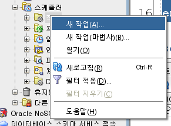
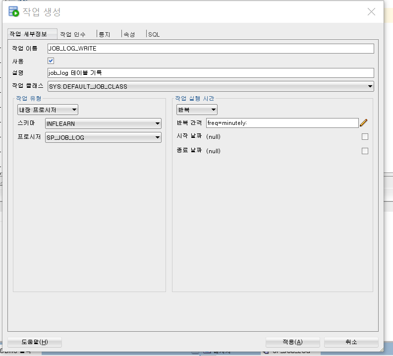
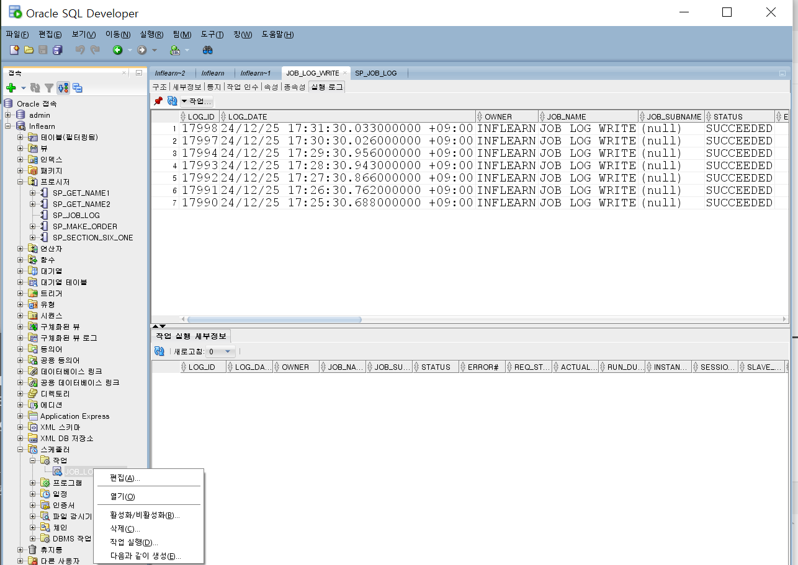
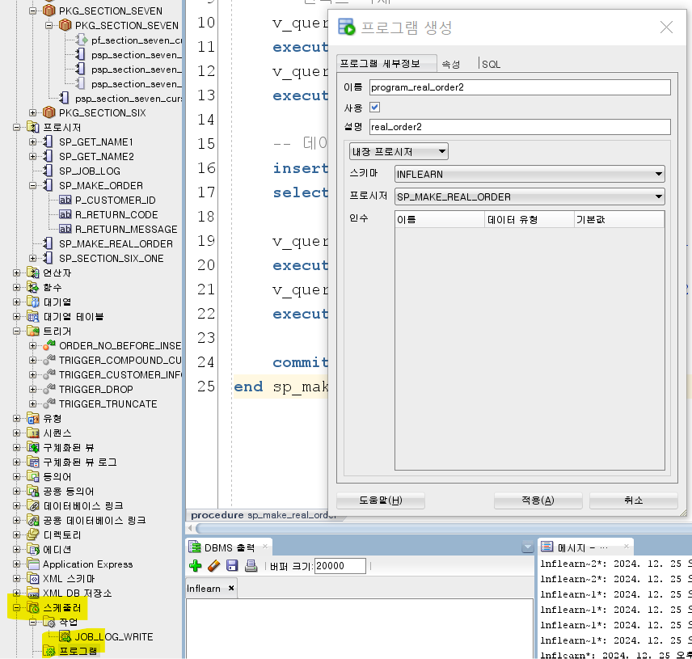
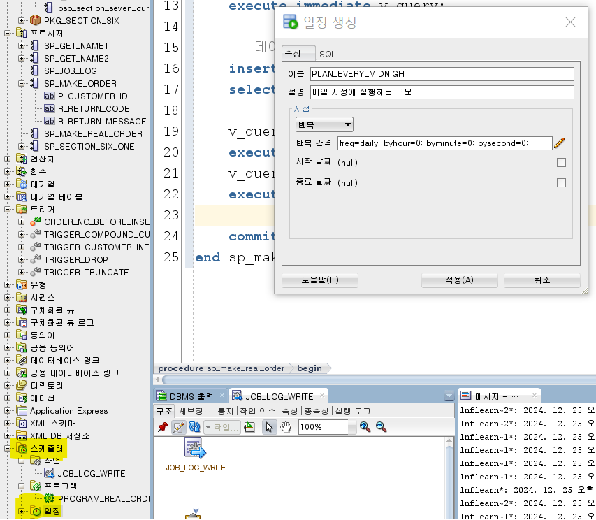
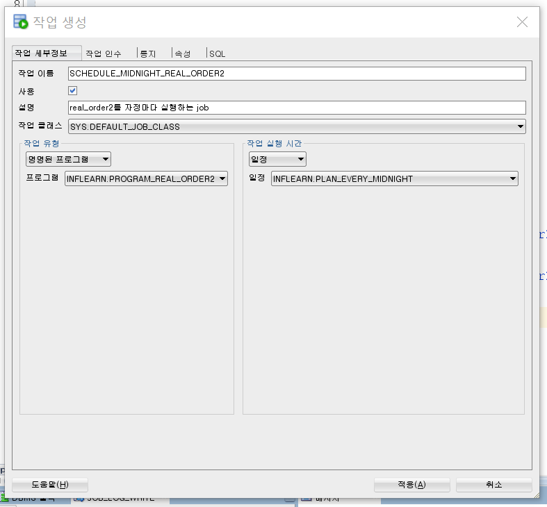

# 스케줄러 (DBMS_SHCEDULER)

## Scheduler
- Application (Java, PHP, ...)
- Crontab (Linux, UNIX, ...)
- Oracle Scheduler

## DBMS_SCHEDULER (10g new feature)
- 작업 (DBMS_SCHEDULER.create_job)
  - 단독으로 실행 가능
  - 프로그램, 일정을 이용하여 작업 가능
  - select * from user_scheduler_jobs;
- 프로그램 (DBMS_SCHEDULER.create_program)
  - select * from user_scheduler.programs;
- 일정 (DBMS_SCHEDULER.create_schedule)
  - select * from user_scheduler_schedules;


## 실습

### 테이블 및 프로시저 생성

```sql
create table job_log (
    job_action varchar2(100)
  , register_day date default sysdate
);
```

```sql
create or replace procedure SP_JOB_LOG
as
begin
    insert into job_log(job_action)
    values ('SP_JOB_LOG');
    commit;
end SP_JOB_LOG;
```





이렇게 새 스케줄러를 만들려다가 권한 문제가 발생하면 `사용자 권한` 탭의 `CREATE ANY JOB`을 부여하면 된다.

```sql
select * from user_scheduler_jobs;
```

스케줄러가 등록이 됐는지 확인할 수 있다.

```sql
select * from job_log;
```

job_log라는 아까 전에 만들었던 테이블을 조회하면 매 분마다 돌아가는 프로시저로 데이터가 꽂히는 것을 확인할 수 있다.



스케줄러 메뉴를 통해 실행 이력을 확인할 수도 있다. SQL Developer 툴 한정이다.

```sql
select * from user_scheduler_job_log;
```

이 테이블로도 확인할 수 있다.

## 시작 시간이 정해진 스케줄러 실습

### 테스트 프로시저 생성 및 실행

```sql
create or replace procedure sp_make_real_order
as
    v_query varchar2(1000);
begin
    -- 테이블 데이터 삭제
    v_query := 'truncate table real_order2 drop storage';
    execute immediate v_query;

    -- 인덱스 삭제
    v_query := 'drop index idx_real_order2_01';
    execute immediate v_query;
    v_query := 'drop index idx_real_order2_02';
    execute immediate v_query;

    -- 데이터 입력
    insert into real_order2
    select * from real_order;

    v_query := 'create index idx_real_order2_01 on real_order2(order_no, order_sequence)';
    execute immediate v_query;
    v_query := 'create index idx_real_order2_02 on real_order2(customer_id)';
    execute immediate v_query;

    commit;
end sp_make_real_order;
```

만약에 안 된다면 오류를 잘 확인해보고서
- 혹여 real_order, real_order2 등의 테이블의 데이터가 너무 많지는 않은지
- 인덱스가 설정이 안 되어있다든지

등의 문제이거든 적절하게 해결하면 된다.

### 프로그램 생성



이렇게 하면 어디서든지 쓸 수 있는 프로그램 단위가 만들어지는 것이다. 잡(스케줄러)이 아니다.

실행하면 프로그램 안의 잡이 실행된다.



매일 자정에 실행하는 구문을 만들 수도 있다.



```sql
select * from user_scheduler_jobs;
```

job에 잘 등록됐는지 확인해보면 끝이다.

이렇게 프로그램, 일정을 활용해서 작업을 만드는 등으로도 활용할 수 있다.