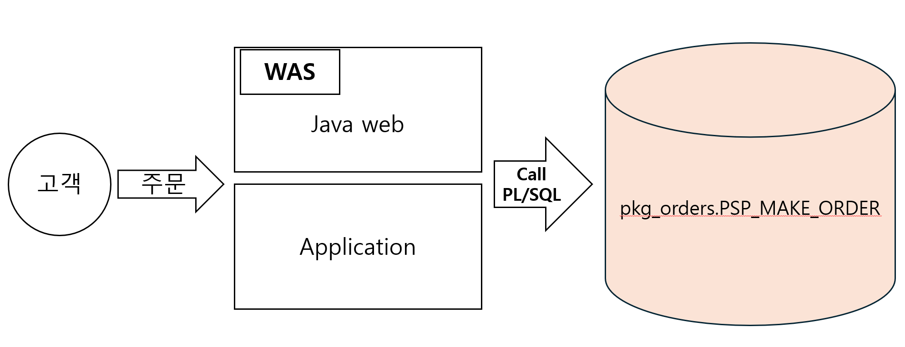
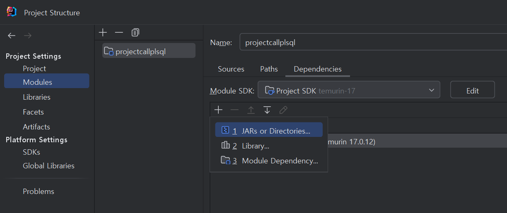

# Call PL/SQL

외부에서 DB 패키지 사용하기

시나리오 : Java 웹 애플리케이션에서 PL/SQL을 호출하여 사용한다.






```java
import org.apache.commons.lang3.StringUtils;

import java.sql.*;

/**
 * JDBC를 이용하여 PL/SQL 사용하기
 */
public class JdbcOraclePLSQL {
    public static void main(String[] args) {
        String driver = "oracle.jdbc.driver.OracleDriver";
        String url = "jdbc:oracle:thin:@localhost:1521:xe";
        String userId = "inflearn";
        String password = "cometrue";

        String query = "";
        int result = 0;

        Connection conn = null; // DB에 connection된 객체를 저장
        Statement stmt = null; // connection 객체에 실행문을 던지는 역할(창구)
        ResultSet rs = null; // select 결과값을 받아옴
        CallableStatement callableStatement = null; // PL/SQL 실행을 위한 인터페이스 CallableStatement 사용

        try {
            /* Driver Loading */
            Class.forName(driver);
            /* Oracle Connection 여기까지만 실행해보고 실제 오라클 접속이 되었는지 체크 */
            conn = DriverManager.getConnection(url, userId, password);
            /* jdbc는 기본적으로 자동커밋을 한다. 자동커밋 해제 */
            conn.setAutoCommit(false); // 자동커밋 해젠
            stmt = conn.createStatement();
            System.out.println("Connection Success");

            /* Statement - select, insert, update, delete */

            /* Result Set, Print */
            query = "select * from menu";
            rs = stmt.executeQuery(query);

            while(rs.next()) {
                System.out.printf("MENU_ID : %s, MENU_TYPE : %s, MENU_NAME : %s \n", rs.getString("menu_id"), rs.getString("menu_type"), rs.getString("menu_name"));
            }

            callableStatement = conn.prepareCall("{call pkg_orders.PSP_MAKE_ORDER(?, ?, ?)}");
            callableStatement.registerOutParameter(1, Types.VARCHAR);
            callableStatement.registerOutParameter(2, Types.VARCHAR);
            callableStatement.setString(3, "C002");
            callableStatement.execute();

            // 프로시저 파라미터 순서에 맞게 해야함.
            String returnCode = callableStatement.getString(1);
            String returnMessage = callableStatement.getString(2);

            System.out.println("returnCode = " + returnCode);
            System.out.println("returnMessage = " + returnMessage);

            // Transaction 처리는 application에서
            if(StringUtils.equals(returnCode, "0")) {
                conn.commit(); // 자동커밋 사용
            } else {
                conn.rollback();
            }
        } catch (ClassNotFoundException clex) {
            clex.fillInStackTrace();
        } catch (SQLException sqlex) {
            System.out.println(sqlex.getErrorCode());
        } finally {
            try {
                if(rs != null) rs.close();
                if(stmt != null) stmt.close();
                if(callableStatement != null) callableStatement.close();
                if(conn != null) conn.close();
            } catch (SQLException closeSqlex) {
                System.out.println(closeSqlex.getErrorCode());
            }
        }
    }
}
```